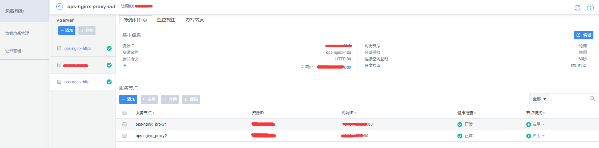
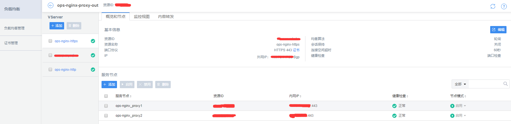

# ucloud_load_balance
## 1.业务架构


## 2.业务需求
```text
1.业务使用HTTPS协议
2.业务访问HTTP协议时，可以自动跳转到HTTPS
```

## 3.业务实施
>### 1.打开Ucloud控制台负载均衡服务
>>#### 1.创建HTTP负载均衡(80)

>>#### 2.创建HTTPS负载均衡(443)


>### 2.在nginx上做反向代理
```bash
xxx.com.conf:
 
upstream TEST {
    server xxx:80 max_fails=3 fail_timeout=30s;
    server xxx:80 max_fails=3 fail_timeout=30s;
    server xxx:80 max_fails=3 fail_timeout=30s;
}
 
server {
    listen       80;
    server_name  xxx.com;
 
    return 301 https://$host$request_uri;
}
 
server {
    listen       443;
    server_name  xxx.com;
 
    location / {
        proxy_set_header Host $host;
        proxy_set_header X-Forwarded-For $proxy_add_x_forwarded_for;
        proxy_pass  http://TEST;
    }
 
    access_log  /data/nginx/log/xxx.com.access.443.log  main;
}
```

>### 3.HTTP自动跳转HTTPS逻辑
```text
当在浏览器中访问 http://xxx.com 时，
首先，通过Ucloud的负载均衡(80)端口 将请求转发 到 nginx代理的80端口上
其次，nginx发现有监听80端口，根据请求策略做了301重定向，所以会将请求跳转到 https://xxx.com
然后，通过访问 https://xxx.com，又将请求重新访问 Ucloud的负载均衡(443)端口，Ucloud的负载均衡(443)进行反向代理，将请求转发到 nignx的443端口上
最后，nginx发现有监听443端口，根据请求策略，将请求反向代理到后端业务服务器上

之所以这么操作，是由于Ucloud负载均衡在上传SSL证书后，做HTTPS代理，无法正常反向代理到nginx端。这是由于nginx中也配置了SSL证书。
如果，使用Ucloud负载均衡的HTTPS协议，那么nginx端只能使用HTTP协议，不能使用HTTPS协议。
由于Ucloud负载均衡模块服务还有点欠缺，没有办法做到HTTP自动跳转到HTTPS，只能在Nginx端，进行重新转发，用于临时解决该问题。
```